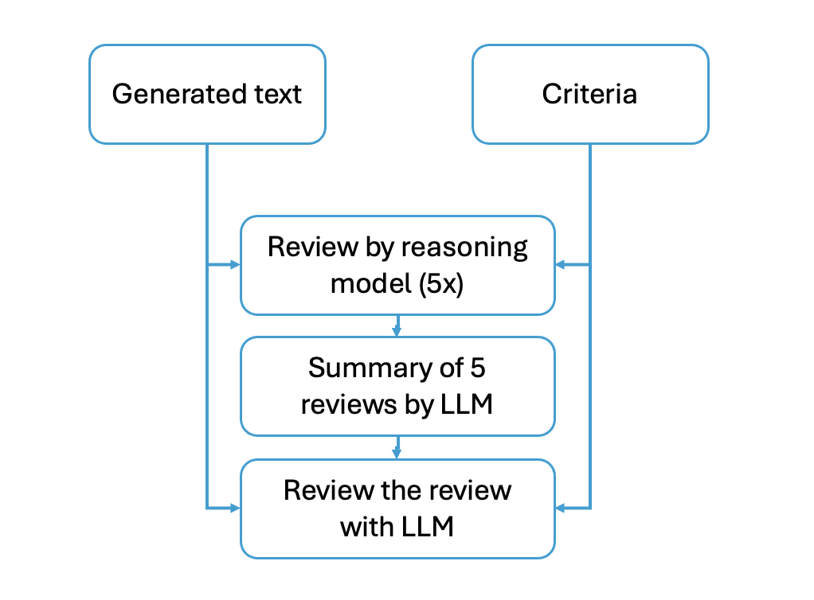

# verhaal_speciaal_python
A repository for the python / Jupyter Notebooks for Verhaal Speciaal (Michiel's work)

This repo contains three Notebooks:
1. Verhaal_speciaal.ipynb. => use this notebook to create a verhaal speciaal story
2. Review_reading_level_with_one_llm.ipynb => use this notebook to review the story with one LLM (GPT-4o)
3. Multiple_reviews_with_o1-preview.ipynb => use this notebook to review the story with a reasoning model.

It's best to use notebooks 1 and 3. 

I also simplified the text levels, see Nieuwe leesniveaus gedefinieerd.docx. 

For Notebook 3 I have used this workflow:  

